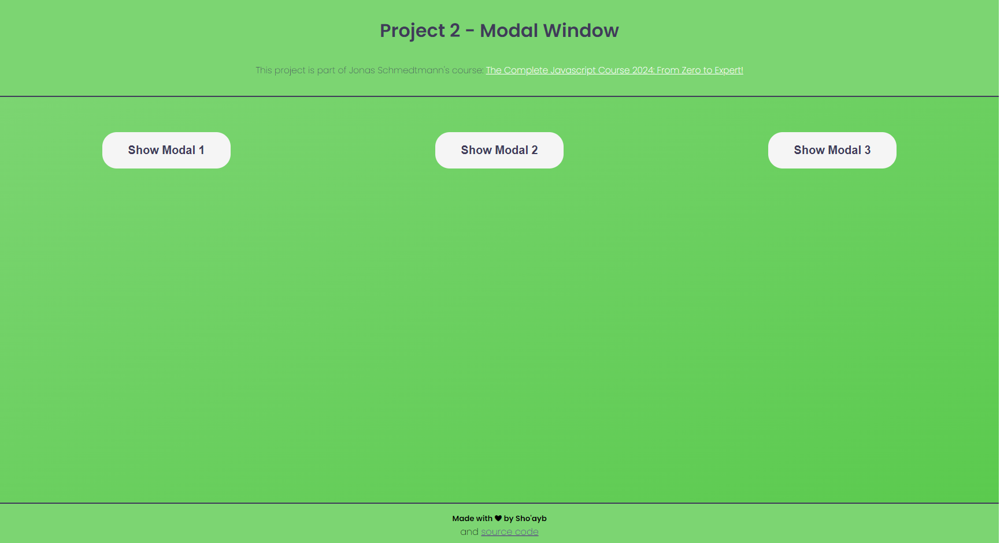
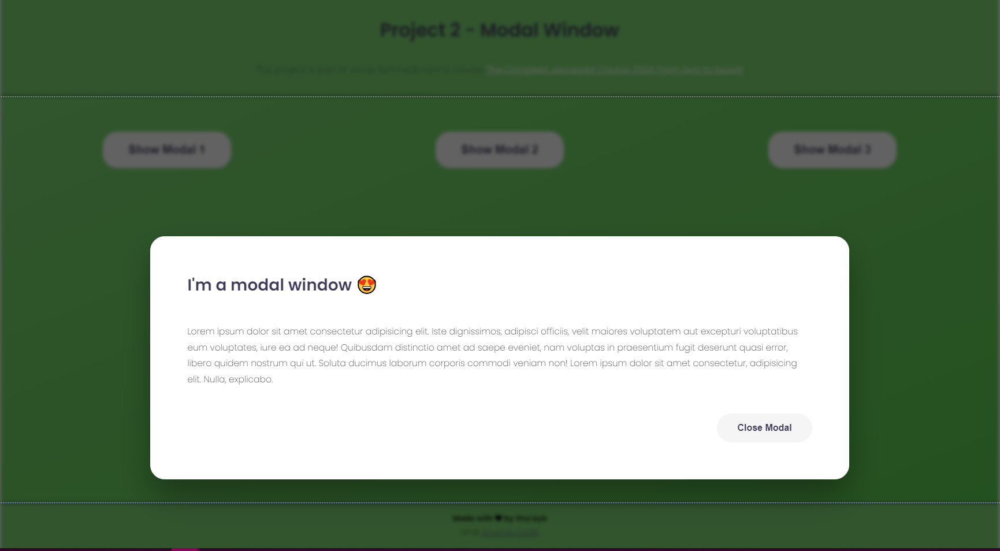

# TABLE OF CONTENTS

[Project Title](#project-title)
[Description](#description)
[Installation](#installation)
[Usage](#usage)
[Guidelines](#guidelines)
[Testing the Application](#testing-the-application)
[Github](#github)
[Contact Us](#contact-us)
[Licence](#licence)

## Project Title

Modal Window By Jonas Schmedtmann

## Description

It is simple webpage containing button elements that open a modal window. It is a simple project to begin interacting with document elements on a webpage using Javascript.

## Installation

No installation required: open the index.html file in your web browser of choice.

## Usage

Clicking on any of the Show Modal buttons will open the modal window.

## Guidelines

No contribution is required.

## Testing the Application

None

## Images of the webpage

## Deployed Live

[Modal Window](https://sho-ayb.github.io/modal-window-jonas/)

## Github

https://github.com/Sho-ayb

## Questions

Sho.ayb@outlook.com

## Licence

MIT License

Please click on the badge for more details on the licence.

